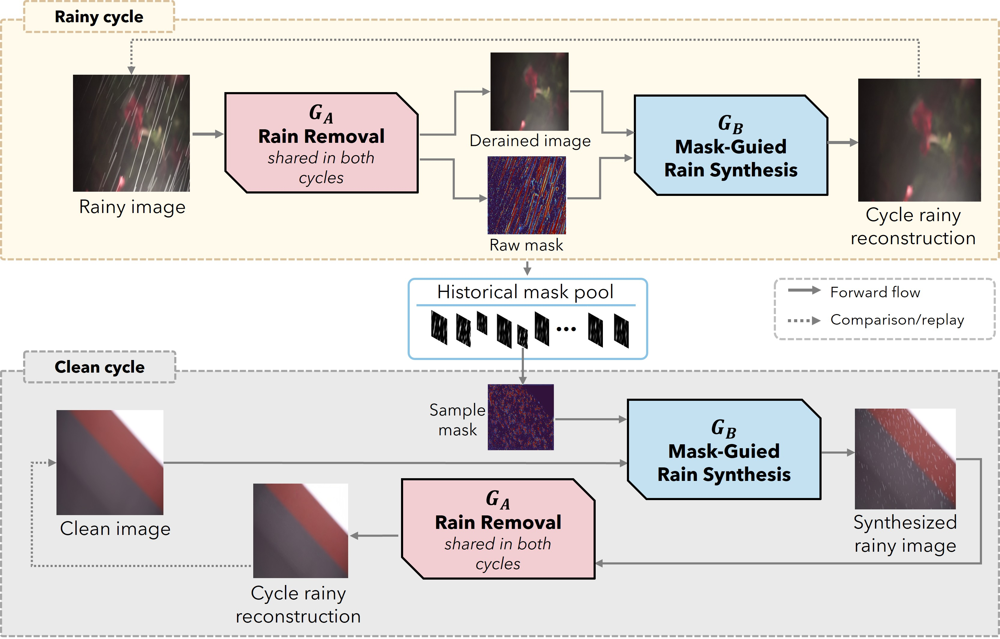

# DRC-Derain: Detect-Restore-Compose Framework for Unpaired Single-Image Deraining
DRC-Derain: Detect-Restore-Compose Framework for Unpaired Single-Image Deraining

Unpaired single-image deraining avoids the need for aligned rainy-clean pairs, but existing translation-
based formulations remain highly underconstrained because the generator is typically allowed to
reconstruct the entire image. This is unnecessary for rain removal, where degradation usually
affects only a subset of the scene, and may lead to unwanted modifications of reliable background
content. We propose DRC-Derain, a Detect-Restore-Compose framework that reformulates unpaired
deraining as localized image editing. A frequency-aware detector first estimates the rain support by
combining weak photometric anchors, learnable spectral evidence, and spatial contextual reasoning.
The restoration network then predicts content only for the detected regions, while rain-free pixels
are preserved directly from the input through mask-guided composition. To learn this formulation
without paired supervision, the same predicted support is reused in a mask-guided reverse mapping,
restricting rain synthesis to the supplied region and turning cycle reconstruction into an additional
localization signal. Historical predicted masks are further replayed on unrelated clean images to
generate controlled synthetic rain. Since the initial photometric prior is imperfect, we employ
adaptive weak-mask supervision that adjusts its influence according to degradation-aware restoration
quality rather than treating it as fixed pseudo-ground truth. Experiments on synthetic and real-world
benchmarks demonstrate that DRC-Derain achieves competitive deraining performance while better
preserving unaffected image content and improving robustness under unpaired training.

## Model Architecture

### Installation

python==3.10

pip install -r requirements.txt

## Training dataset
Our training dataset can be found and downloaded in train_data.txt

## Example Results

Qualitative results:

  

## Code

The code will be released soon.

## 🎥 Demo Video

Watch the demo on [YouTube](https://www.youtube.com/watch?v=uJauqdxdj7A).
